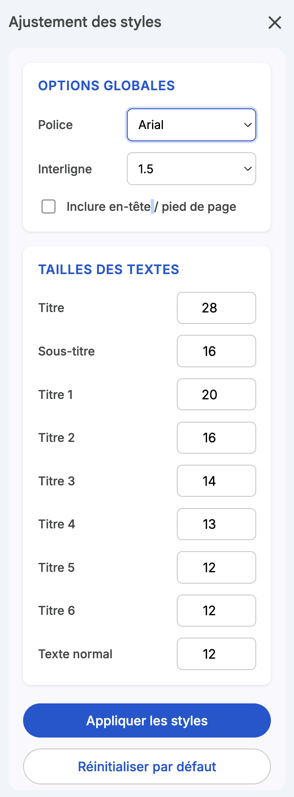

# Ajustement des styles pour Google Docs

Cet outil (add-on) pour Google Docs permet de redimensionner rapidement et uniformément toutes les polices d'un document (Texte normal, Titres, Sous-titres, Titres 1 à 6).

Développé par **Fabrice Faucheux**.

## 🌟 Fonctionnalités

- **Interface Moderne** : Panneau latéral interactif basé sur les principes du Material Design 3.
- **Options Globales** : Modifiez en un clic la **police de caractères** (parmi des dizaines de Google Fonts) et l'**interligne** de l'ensemble du document.
- **Personnalisation fine** : Ajustez individuellement la **taille** et la **couleur** pour chaque type de texte (Titre, Sous-titre, Titre 1-6, Texte normal) grâce à des sélecteurs de couleur dédiés.
- **Application Récursive** : Redimensionne et recolore les textes dans le corps du document, ainsi que dans les listes et les tableaux.
- **En-têtes et Pieds de page** : Option pour inclure ou exclure les en-têtes et les pieds de page lors des modifications.
- **Sauvegarde des Préférences** : Mémorisation automatique de vos réglages (tailles, couleurs actives, polices, etc.) pour ne pas avoir à les ressaisir à chaque ouverture.
- **Action Rapide** : Option dans le menu pour réinitialiser instantanément le texte normal à une taille de 12pt.

## 🚀 Installation (Google Apps Script)

Pour utiliser ce script dans l'un de vos documents Google Docs :

1. Ouvrez un document Google Docs.
2. Allez dans le menu **Extensions > Apps Script**.
3. Supprimez le code par défaut et remplacez-le par le contenu du fichier `Code.gs`.
4. Créez un nouveau fichier HTML (Fichier > Nouveau > HTML), nommez-le **sidebar.html** et collez-y le contenu du fichier `sidebar.html`.
5. Sauvegardez le projet et retournez sur votre Google Docs.
6. Actualisez la page. Vous verrez apparaître un nouveau menu **"Ajustement des styles"**.

## 💻 Code Source

Le projet contient deux fichiers principaux :
- `Code.gs` : Gère la logique côté serveur (interaction avec l'API Google Docs, récupération/sauvegarde des préférences).
- `sidebar.html` : Gère l'interface utilisateur (UI), les styles (CSS) et la logique côté client (JavaScript).

## 📄 Licence

Ce projet est open source et disponible pour toute modification personnelle ou professionnelle.
